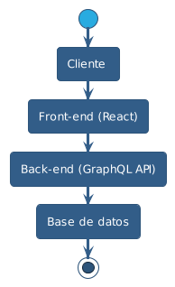

# Plataforma de Productos para Eventos

Este reto es una plataforma web desarrollada en ReactJS que permite a los usuarios ver los productos para sus eventos. Los productos pueden ser de diferentes tipos, como productos simples, productos rentables y espacios para eventos.

## Aspectos tecnicos para levantar el proyecto 

- **SQL:** en la carpeta BD he dejado un uey_bd.sql con data de prueba

- **Nota:** antes de iniciar el backend debe configurar el archivo **backend/src/db/dbConfig.ts** con los valores de su Conexion **( usuario, password )**

- **backend:**
  - npm run install 
  - npm run start
  - url: http://localhost:4000
    
- **frontend:**
  - npm run install 
  - npm run dev
  - url: http://localhost:5173 ( ojo el puerto puede variar )
    

    
## Arquitectura del Sistema

El sistema se compone de los siguientes elementos:

- **Cliente**: Interactúa con la plataforma web a través del front-end desarrollado con ReactJS.
- **Front-end**: Desarrollado con ReactJS, proporciona la interfaz de usuario y se comunica con el back-end a través de una API de GraphQL.
- **Back-end**: Implementa una API de GraphQL para recibir y responder consultas del front-end. Accede a una base de datos para obtener y almacenar la información de los productos.
- **Base de datos**: Almacena la información de los productos, incluyendo los campos básicos y los campos adicionales específicos de cada tipo de producto.



## Estructura de Datos

A continuación se detallan los modelos de datos utilizados en el sistema:

**Producto**
- **id** (INTEGER, clave primaria, autoincremental)
- **nombre** (STRING, longitud máxima 255, no nulo)
- **vendedor** (STRING, longitud máxima 255, no nulo)
- **precio** (FLOAT, no nulo)
- **tipo_producto_id** (INTEGER, no nulo)

**Renta**  
- **id** (INTEGER, clave primaria, autoincremental)
- **producto_id** (INTEGER, no nulo)
- **tipo_renta_id** (INTEGER, no nulo)
- **fecha_inicio** (DATE, no nulo)
- **fecha_fin** (DATE, no nulo)
- **cantidad_rentada** (INTEGER, no nulo)

**TipoProducto**
- **id** (INTEGER, clave primaria, autoincremental)
- **nombre** (STRING, longitud máxima 255, no nulo)

**TipoRenta**
- **id** (INTEGER, clave primaria, autoincremental)
- **nombre** (STRING, longitud máxima 255, no nulo)

**Inventario**
- **id** (INTEGER, clave primaria, autoincremental)
- **producto_id** (INTEGER, no nulo)
- **cantidad_existente** (INTEGER, no nulo)
- **cantidad_rentada** (INTEGER, no nulo)
- **cantidad_restante** (INTEGER, no nulo)

**Imagenes** 
- **id** (INTEGER, clave primaria, autoincremental)
- **producto_id** (INTEGER, no nulo)
- **imagen** (STRING, longitud máxima 255, no nulo)

**Espacios**
- **id** (INTEGER, clave primaria, autoincremental)
- **producto_id** (INTEGER, no nulo)
- **posicion** (STRING, longitud máxima 255, no nulo)
- **referencia** (STRING, longitud máxima 255, no nulo)

## Consultas GraphQL

Aquí tienes ejemplos de consultas GraphQL que se pueden realizar al back-end:
 

**listAllProducts: Productos**
- Listado de todos los productos separados por 3 tipos Simples, Rentables y Espacios
```graphql
 query Query {
  listAllProducts {
    productosSimples {
      id
      nombre
      vendedor
      precio
      tipoProducto {
        id
        nombre
      }
      imagenes {
        id
        imagen
      }
      inventario {
        id
        cantidad_existente
        cantidad_restante
        disponible
      }
    }
    productosRentables {
      id
      nombre
      vendedor
      precio
      tipoProducto {
        id
        nombre
      }
      imagenes {
        id
        imagen
      }
      inventario {
        id
        cantidad_existente
        cantidad_rentada
        cantidad_restante
        disponible
      }
      renta {
        id
        fecha_inicio
        fecha_fin
        cantidad_rentada
        tipoRenta {
          id
          nombre
        }
      }
    }
    productosEspacios {
      id
      nombre
      vendedor
      precio
      tipoProducto {
        id
        nombre
      }
      imagenes {
        id
        imagen
      }
      renta {
        id
        fecha_inicio
        fecha_fin
        cantidad_rentada
        tipoRenta {
          id
          nombre
        }
      }
      espacio {
        id
        posicion
        referencia
      }
    }
  }
}
```

**getSimpleById(…): ProductoSimple**
- listado de productos simples por ID
```graphql
 query GetSimpleById($getSimpleByIdId: String) {
  getSimpleById(id: $getSimpleByIdId) {
    id
    nombre
    vendedor
    precio
    tipoProducto {
      id
      nombre
    }
    imagenes {
      id
      imagen
    }
    inventario {
      id
      cantidad_existente
      cantidad_restante
      disponible
    }
  }
}
```

**getRentableById(…): ProductoRentable**
- listado de productos rentables por ID
```graphql
query GetRentableById($getRentableByIdId: String) {
  getRentableById(id: $getRentableByIdId) {
    id
    nombre
    vendedor
    precio
    tipoProducto {
      id
      nombre
    }
    imagenes {
      id
      imagen
    }
    inventario {
      id
      cantidad_existente
      cantidad_rentada
      cantidad_restante
      disponible
    }
    renta {
      id
      fecha_inicio
      fecha_fin
      cantidad_rentada
      tipoRenta {
        id
        nombre
      }
    }
  }
}
```

**getEspaciosById(…): ProductoEspacio**
- listado de productos espacios por ID
```graphql
 query GetEspaciosById($getEspaciosByIdId: String) {
  getEspaciosById(id: $getEspaciosByIdId) {
    id
    nombre
    vendedor
    precio
    tipoProducto {
      id
      nombre
    }
    imagenes {
      id
      imagen
    }
    renta {
      id
      fecha_inicio
      fecha_fin
      cantidad_rentada
      tipoRenta {
        id
        nombre
      }
    }
    espacio {
      id
      posicion
      referencia
    }
  }
}
```

**disponible(…): InventarioRentable**
- consulta de disponibilidad
```graphql
 query Disponible($disponibleId: String) {
  disponible(id: $disponibleId) {
    id
    cantidad_existente
    cantidad_rentada
    cantidad_restante
    disponible
  }
}
```

## Schema de datos solo los mas relevantes

- Producto Simple 

```graphql
type ProductoSimple {
  id: ID!
  nombre: String!
  vendedor: String!
  precio: Float!
  tipoProducto: TipoProducto!
  imagenes: [Imagen]!
  inventario: InventarioSimple 
}
```
- Producto Rentable
```graphql
type ProductoRentable {
  id: ID!
  nombre: String!
  vendedor: String!
  precio: Float!
  tipoProducto: TipoProducto!
  imagenes: [Imagen]!
  inventario: InventarioRentable!
  renta: Renta!
}
```
- Producto Espacio
```graphql
type ProductoEspacio {
  id: ID!
  nombre: String!
  vendedor: String!
  precio: Float!
  tipoProducto: TipoProducto!
  imagenes: [Imagen]!
  renta: Renta!
  espacio: Espacio!
}
```
- Productos

```graphql
type Productos {
  productosSimples: [ProductoSimple]
  productosRentables: [ProductoRentable]
  productosEspacios: [ProductoEspacio]
}

```

- Inventario Rentable

```graphql
 type InventarioRentable {
  id: ID!
  cantidad_existente: Int!
  cantidad_rentada: Int!
  cantidad_restante: Int!
  disponible: Int
} 
```

- Inventario Simple

```graphql
type InventarioSimple {
  id: ID!
  cantidad_existente: Int!
  cantidad_restante: Int!
  disponible: Int
}
```

## Decisiones Tomadas


En este diseño se optó por utilizar **GraphQL** como lenguaje de consulta para el back-end, ya que permite obtener solo la información necesaria para cada tipo de producto y evita el exceso de datos. Además, se utilizó **ReactJS** para construir el front-end debido a su capacidad para crear componentes reutilizables y su enfoque en el rendimiento.

Se propuso un modelo de datos simple que representa los diferentes tipos de productos y sus campos específicos. Los componentes de visualización se adaptan a cada tipo de producto y muestran la información correspondiente. Para la integración del mapa de Google Maps, se utilizó la biblioteca react-google-maps/api para agregar la funcionalidad de visualización de ubicaciones en el mapa dentro del componente de Espacio.

Se ha decidido utilizar tailwind en el frontend ya que su uso es mas estetico no obstante el diseño ha sido dejado en segundo plano enfocandome en la funcionalidad y las consultas a Graphql

en el frontend se utilizo Vite y TSX ya que su flexibilidad y rapidez permiten realizar entornos mucho mas rapido al momento de realizar cualquier frontend.

en el backend se utilizo solo Ts ya que su uso permite controlar los tipos que se necesitan para las consultas.


## Resumen del flujo

- El cliente debera observar los 3 tipos de productos en el home ( Simple, Rentables, Espacios )
- El cliente podra dar click en ver mas detalles y este desplegara un modal con la informacion segun la plantilla filtrada por el tipo de producto ( Simple, Rentables, Espacios )
- El cliente podra darle click en el producto Espacios y podra desplegar el mapa con google maps 
- El servidor podra retornar 4 consultas 
    - **listAllProducts:** que retornara un Type Productos que contiene los 3 Objetos <br> 
    **( ProductoSimple, ProductoRentables, ProductoEspacios )**  
    - **getSimpleById:** que retornara un Type ProductoSimple filtrado por ID 
    - **getRentableById:** que retornara un Type ProductoRentable filtrado por ID
    - **getEspaciosById:** que retornara un Type ProductoEspacio filtrado por ID
    - **disponible:** que retornara un Type InventarioRentable filtrado por ID para usar la propiedad disponible para determinar si esta o no disponible.
- el servidor se conectara a una BD mysql con sequalize para obtener los datos de ejemplo.


## Entregables:
 - Un diagrama de arquitectura del sistema. **check!**

 - Un detalle de los `data models` y estructuras de datos utilizadas, si es que aplican. **check!**
 
 - Ejemplos de las consultas que se van a hacer al back-end utilizando GraphQL. **check!** 
 
 - Código que implementa la solución detallada anteriormente, utilizando data de prueba. **check!**
 
 - Una explicación de las decisiones tomadas. **check!**


